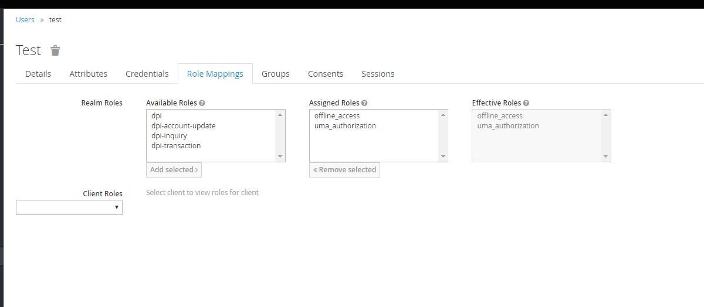
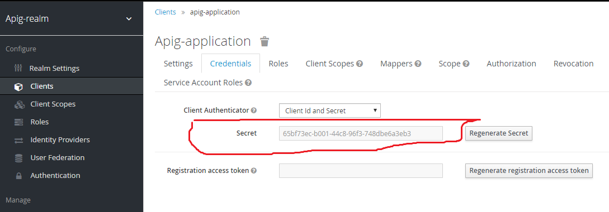

#KeyCloak 
##What is KeyCloak
Keycloak is a single sign on solution for web apps and RESTful web services.
The goal of Keycloak is to make security simple so that it is easy for 
application developers to secure the apps and services they have deployed
in their organization. Security features that developers normally have 
to write for themselves are provided out of the box and are 
easily tailorable to the individual requirements of
your organization. Keycloak provides customizable user 
interfaces for login, registration, administration, and 
account management. You can also use Keycloak as an 
integration platform to hook it into existing LDAP
and Active Directory servers. You can also delegate 
authentication to third party 
identity providers like Facebook and Google+.

##Features
- Single-Sign On and Single-Sign Out for browser applications

- OpenID Connect support.

- OAuth 2.0 support.

- SAML support.

- Identity Brokering - Authenticate with external OpenID Connect or SAML Identity Providers.

- Social Login - Enable login with Google, GitHub, Facebook, Twitter, and other social networks.

- User Federation - Sync users from LDAP and Active Directory servers.

- Kerberos bridge - Automatically authenticate users that are logged-in to a Kerberos server.

- Admin Console for central management of users, roles, role mappings, clients and configuration.

- Account Management console that allows users to centrally manage their account.

- Theme support - Customize all user facing pages to integrate with your applications and branding.

- Two-factor Authentication - Support for TOTP/HOTP via Google Authenticator or FreeOTP.

- Login flows - optional user self-registration, recover password, verify email, require password update, etc.

- Session management - Admins and users themselves can view and manage user sessions.

- Token mappers - Map user attributes, roles, etc. how you want into tokens and statements.

- Not-before revocation policies per realm, application and user.

- CORS support - Client adapters have built-in support for CORS.

- Service Provider Interfaces (SPI) - A number of SPIs to enable customizing various aspects of the server. Authentication flows, user federation providers, protocol mappers and many more.

- Client adapters for JavaScript applications, WildFly, JBoss EAP, Fuse, Tomcat, Jetty, Spring, etc.

- Supports any platform/language that has an OpenID Connect Resource Provider library or SAML 2.0 Service Provider library.

##Core Concepts and Terms
There are some key concepts and terms you should be aware of before attempting to 
use Keycloak to secure your web applications and REST services.

###users
Users are entities that are able to log into your system. 
They can have attributes associated with themselves like email, username, address,
 phone number, and birth day.
They can be assigned group membership and have specific roles assigned to them.

###authentication
The process of identifying and validating a user.

###authorization
The process of granting access to a user.

###credentials
Credentials are pieces of data that Keycloak uses to verify the identity of a user.
 Some examples are passwords, one-time-passwords, digital certificates, or even fingerprints.

###roles
Roles identify a type or category of user. Admin, user, manager, and employee
 are all typical roles that may exist in an organization. 
 Applications often assign access and permissions to specific roles rather 
than individual users as dealing with users can be too fine grained and hard to manage.

###user role mapping
A user role mapping defines a mapping between a role and a user.
 A user can be associated with zero or more roles. 
 This role mapping information can be encapsulated into tokens and assertions so
 that applications can decide access permissions on various resources they manage.
 
 
###composite roles
A composite role is a role that can be associated with other roles. 
For example a superuser composite role could be associated with the sales-admin and order-entry-admin roles. 
If a user is mapped to the superuser role they also inherit the sales-admin and order-entry-admin roles. 

###groups
Groups manage groups of users. Attributes can be defined for a group. You can map roles to a group as well. 
Users that become members of a group inherit the attributes and role mappings that group defines.

###realms
A realm manages a set of users, credentials, roles, and groups. A user belongs to and logs into a realm.
 Realms are isolated from one another and can only manage and authenticate the users that they control.
 
###clients
Clients are entities that can request Keycloak to authenticate a user. 
Most often, clients are applications and services that want to use Keycloak to 
secure themselves and provide a single sign-on solution. Clients can also be 
entities that just want to request identity information or an access 
token so that they can securely invoke other services on the network that are secured by Keycloak. 

###client adapters
Consent is when you as an admin want a user to give permission
 to a client before that client can participate in the
authentication process. After a user provides their credentials, Keycloak
will pop up a screen identifying the client requesting a login and what 
identity information is requested of the user. User can decide whether or not to grant the request.

###client scopes
When a client is registered, you must define protocol mappers and role scope mappings for that client.
 It is often useful to store a client scope, to make creating new clients easier
by sharing some common settings. This is also useful for requesting some 
claims or roles to be conditionally based on the value of scope parameter. 
Keycloak provides the concept of a client scope for this.

###client role
Clients can define roles that are specific to them. This is basically a role namespace dedicated to the client

###identity token
A token that provides identity information about the user. Part of the OpenID Connect specification.

###access token
A token that can be provided as part of an HTTP request that grants access to the service being invoked on. 
This is part of the OpenID Connect and OAuth 2.0 specification.

###assertion
Information about a user. This usually pertains to an XML blob that is included in
 a SAML authentication response that provided identity metadata about an authenticated user.
 
###service account
Each client has a built-in service account which allows it to obtain an access token.

###direct grant
A way for a client to obtain an access token on behalf of a user via a REST invocation.

###protocol mappers
For each client you can tailor what claims and assertions are stored in the 
OIDC token or SAML assertion. You do this per client by creating and configuring protocol mappers.

###session
When a user logs in, a session is created to manage the login session.
 A session contains information like when the user logged in and what applications 
have participated within single-sign on during that session. Both admins and users can view session information.
  

###user federation provider
Keycloak can store and manage users. Often, companies already have LDAP or Active Directory services
that store user and credential information. You can point Keycloak to validate credentials
from those external stores and pull in identity information.  

###identity provider
An identity provider (IDP) is a service that can authenticate a user. Keycloak is an IDP.

###identity provider federation
Keycloak can be configured to delegate authentication to one or more IDPs.
 Social login via Facebook or Google+ is an example of identity provider federation.
 You can also hook Keycloak to delegate authentication to any other OpenID Connect or SAML 2.0 IDP.
 
###identity provider mappers
When doing IDP federation you can map incoming tokens and assertions to user and session attributes. 
This helps you propagate identity information from the external IDP to your client requesting authentication. 

###required actions
Required actions are actions a user must perform during the authentication process.
 A user will not be able to complete the authentication process until these actions are complete.
  For example, an admin may schedule users to reset their passwords every month.
An update password required action would be set for all these users.

###authentication flows
Authentication flows are work flows a user must perform when interacting with 
certain aspects of the system. A login flow can define what credential 
types are required. A registration flow defines what profile information a user 
must enter and whether something like reCAPTCHA must be used to filter out bots.
 Credential reset flow defines what actions a user must do before they can reset their password.
 
 ###events
 Events are audit streams that admins can view and hook into.
 
 ###themes
 Every screen provided by Keycloak is backed by a theme. 
 Themes define HTML templates and stylesheets which you can override as needed.
 
 ##Admin Console
 The bulk of your administrative tasks will be done through the Keycloak Admin 
 Console. You can go to the console url directly at http://192.168.100.111/auth/admin/
 ##Login Page
 Enter Your Username And Password For Login To Console Admin
 ````
 Username : admin 
 password : admin
  ````
##The Master Realm
After Login You See Master Realm <br/>
You Must Select The <b>apig-realm</b> for Config KeyCLoak 

##User Management
This section describes the administration functions for managing users.
###Searching For Users
If you need to manage a specific user, click on <b>Users</b> in the left menu bar.

####Users
This menu option brings you to the <b> user list </b> page. 
In the search box you can type in a full name, last name, or email address
you want to search for in the user database. The query will bring up all 
users that match your criteria. The <b>View all users </b>button will list every
user in the system. This will search just local Keycloak database and 
not the federated database (ie. LDAP) because some backends like LDAP
don’t have a way to page through users. So if you want the users
 from federated backend to be synced into Keycloak database you need to either:
- Adjust search criteria. That will sync just the backend users matching the criteria into Keycloak database.
- Go to User Federation tab and click Sync all users or Sync changed users in the page with your federation provider.
 <br/>


###Creating New Users
To create a user <b>click on Users </b>in the left menu bar.

###Add User
You should see an Add User button. Click that to start creating your new user.<br/>

<br/>
Then You Fill Required Input For Example See This Picture<br/>


###Profile User
After You Create New User You Automatic Enter In Your Profile <br/>


### User Credentials

<br/>
When viewing a user if you go to the Credentials tab you can manage a user’s credentials.

###Changing Passwords
To change a <b>user’s password</b>, type in a new one. A <b>Reset Password </b>button will show 
up that you click after you’ve typed everything in. If the Temporary switch is on, 
this new password can only be used once and the user will be asked to change their
 password after they have logged in.<br><br>
 
Alternatively, if you have email set up, you can send an email to the user 
that asks them to reset their password. Choose Update Password from the Reset 
Actions list box and click Send Email. You can optionally set the validity of 
the e-mail link which defaults to the one preset in Tokens tab in the realm settings.
The sent email contains a link that will bring the user to the update password screen.


###How To RoleMapping

 
 In Tab Role Mapping You Can Assign Roles Available in Table Available Roles 
 
 ###How To Define NEW ROLE
 IN Left Menu You See <b>Roles</b> Click it
 So You See This Picture :<br/>
 
 
 First Click On Add Role Then See This Picture :<br/>
 
 So You Fill Required Input And Click On <b>Save Button </b> For 
 Create New Role .<br/>
  
  
  
  
#How To Config KeyCloak in Java Application 

### Create a File that Name is application.properties

See This Code :<br/>
 
 
 ###KeyCLoak  REALM
 The First Line We Define keycloak Realm 
  when You Login Your KeyCLoak Server You Select KeyCLoak Realm
 <br>
 We Use <b>apig-realm </b> in Program 
````properties
keycloak.realm=apig-realm
``````
 
###KeyCloak Server URL

this Property Define Url Keycloak Server Url
````properties
keycloak.auth-server-url= http://192.168.100.111/auth
````

###KeyCloak SSL REQUIRED
This Config For SSL Config KEyCloak

````properties
keycloak.ssl-required= external
````

###KeyCloak Resource
THis Property Show That We Use Which Resource in KeyCloak

````properties
keycloak.resource=apig-application
````

###KekCloak Bearer Config
THis Config For Redirecting To Server That Request To Keycloak For Security <br/>
if User Have Permission or Role KeyCloak Redirect To  Request URL <br/>
When User don`t Have Role KeyCloak response 401 Status

if This Config is False then server Can not Redirect To Request Url Or 
 to 401 Status Code

````properties
keycloak.bearer-only=true
````

###KeyCloak Define Roles And KeyCloak URL Security Pattern

Every Role May be have Multiple Url <br/> 
for Example  role = dip-transaction can use for These Urls :

- /services/teller/*
  
-  /services/dpi/*
- ....
<br/>
So When Config These Role And Url We Use Array 
For Example

`````properties
keycloak.securityConstraints[0].authRoles[0]=dpi-transaction
keycloak.securityConstraints[0].securityCollections[0].name=protected
keycloak.securityConstraints[0].securityCollections[0].patterns[0]=/services/teller/*
keycloak.securityConstraints[0].securityCollections[0].patterns[1]= /services/dpi/*
keycloak.securityConstraints[0].securityCollections[0].patterns[2]= /UrlSecurity3
keycloak.securityConstraints[0].securityCollections[0].patterns[3]= /UrlSecurity4
``````
 
 
###Test Keycloak in Application With Postman
For Test KeyCloak For Example We Want Send Request To /services/teller/charge With Postman <br>
First We Must Get The Token From KeyCloak Server <br>
So We Fill This Form : <br/>
Go TO Authorization Tab in Postman And Select Authorization Type :
- OAuth 1.0
- OAuth 2.0
- Basic Auth 
<br>
And etc...<br/><br/><br>
 
 <br/><br>
In Right Hand You Can Get The Token With The <b>Get New Access Token</b> Button 
<br/>
When The Click THis Button Form Get The Token Show For You <br><br>
 
<br/><br/><br/>
 ###Token Name  :
 Enter a Favorite Name For Token
 ### Grant Type : 
 Types OF Token That Includes : <br/>
 
- Authorization Code
- Implicit
- Authorization Code
- Password Credentials ( we Recommended )
- Client Credentials
<br><br>
###Access Token URL :
THis Part Config For Url KeyCloak That Get The Token <br>
This Config Value is :
 <b>http://192.168.100.111/auth/realms/apig-realm/protocol/openid-connect/token</b>
 <br><br>
 
###Username : 
The Username that You Define The User On KeyCloak
###password :
The Password That You Define The User ON KeyCLoak

###Client ID
THis Property Get Value THis Picture : <br><br>

####Client Secret :
For This Property is THis Picture : <br> <br>

 
###Scope And Client Authentication id Optional

So You Click The Button Request Token Then You Get The Token
<br>

<br><br>
For The Use This Token Click TH Use THis Token :<br>


<br><br>
So You can Send Your Request To Server URL.


  
  
   
 
 